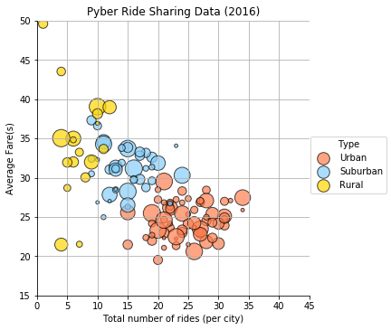
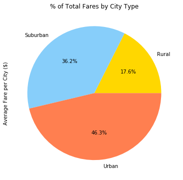
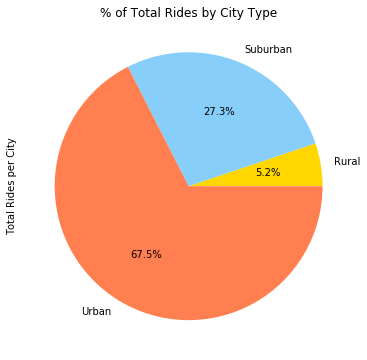
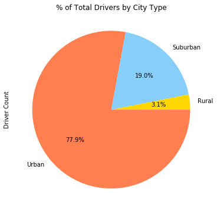

```python
# Dependencies
import pandas as pd
import numpy as np
import matplotlib.pyplot as plt
import csv
import os
import random
import seaborn as sns
%matplotlib inline
```


```python
# Load and read raw csv files into dataframes, then merge together
# first csv file
city_df = pd.read_csv("../05-Matplotlib/Homework05/Instructions/Pyber/raw_data/city_data.csv")
# second csv file 
ride_df = pd.read_csv("../05-Matplotlib/Homework05/Instructions/Pyber/raw_data/ride_data.csv")
# merged df, (city_df then ride_df)
pyber_df = pd.merge(city_df, ride_df)
```


```python
# Work off pyber_df (merged df), and create variables to be values in Dictionary
# city = pyber_df.groupby('city').count()
citytype = pyber_df.groupby('city')['type'].unique().str.get(0)
drivers = pyber_df.groupby('city')['driver_count'].unique().str.get(0)
avefare = pyber_df.groupby('city')['fare'].mean()
totalride = pyber_df.groupby('city')['ride_id'].count()
```


```python
# Turn dictionary into new dataframe
pybersummary_df = pd.DataFrame({"Average Fare per City ($)":avefare, 
                                "Total Rides per City":totalride,
                                "Driver Count":drivers, 
                                "Type":citytype})
pybersummary_df.head()
```


<div>
<style>
    .dataframe thead tr:only-child th {
        text-align: right;
    }

    .dataframe thead th {
        text-align: left;
    }

    .dataframe tbody tr th {
        vertical-align: top;
    }
</style>
<table border="1" class="dataframe">
  <thead>
    <tr style="text-align: right;">
      <th></th>
      <th>Average Fare per City ($)</th>
      <th>Driver Count</th>
      <th>Total Rides per City</th>
      <th>Type</th>
    </tr>
    <tr>
      <th>city</th>
      <th></th>
      <th></th>
      <th></th>
      <th></th>
    </tr>
  </thead>
  <tbody>
    <tr>
      <th>Alvarezhaven</th>
      <td>23.928710</td>
      <td>21</td>
      <td>31</td>
      <td>Urban</td>
    </tr>
    <tr>
      <th>Alyssaberg</th>
      <td>20.609615</td>
      <td>67</td>
      <td>26</td>
      <td>Urban</td>
    </tr>
    <tr>
      <th>Anitamouth</th>
      <td>37.315556</td>
      <td>16</td>
      <td>9</td>
      <td>Suburban</td>
    </tr>
    <tr>
      <th>Antoniomouth</th>
      <td>23.625000</td>
      <td>21</td>
      <td>22</td>
      <td>Urban</td>
    </tr>
    <tr>
      <th>Aprilchester</th>
      <td>21.981579</td>
      <td>49</td>
      <td>19</td>
      <td>Urban</td>
    </tr>
  </tbody>
</table>
</div>


```python
colors=['#FF7F50','#87CEFA','#FFD700']
sns.lmplot(x="Total Rides per City",
          y="Average Fare per City ($)",
          data = pybersummary_df,
          fit_reg=False,
          hue= "Type",
         palette = colors,
         scatter_kws={"s": drivers*5,
                      "alpha":0.7,
                      "linewidth":1,
                      "edgecolor":"black"
                     })
plt.title("Pyber Ride Sharing Data (2016)")
plt.ylim(15,50)
plt.xlim(0,45)
plt.xlabel("Total number of rides (per city)")
plt.ylabel("Average Fare(s)")
plt.grid()
```





```python
#% of Total Fares by City Type
fares_citytype = pybersummary_df.groupby('Type')['Average Fare per City ($)'].sum()
plt.axis("equal")
fare_citychart = fares_citytype.plot(kind='pie', figsize=(6,6), title="% of Total Fares by City Type", 
                                     autopct="%1.1f%%", colors=('#FFD700','#87CEFA','#FF7F50'))
```





```python
#% of Total Fares by City Type
fares_citytype = pybersummary_df.groupby('Type')['Total Rides per City'].sum()
plt.axis("equal")
fare_citychart = fares_citytype.plot(kind='pie', figsize=(6,6), title="% of Total Rides by City Type", 
                                     autopct="%1.1f%%", colors=('#FFD700','#87CEFA','#FF7F50'))
```





```python
#% of Total Fares by City Type
fares_citytype = pybersummary_df.groupby('Type')['Driver Count'].sum()
plt.axis("equal")
fare_citychart = fares_citytype.plot(kind='pie', figsize=(6,6), title="% of Total Drivers by City Type", 
                                     autopct="%1.1f%%", colors=('#FFD700','#87CEFA','#FF7F50'))
```




